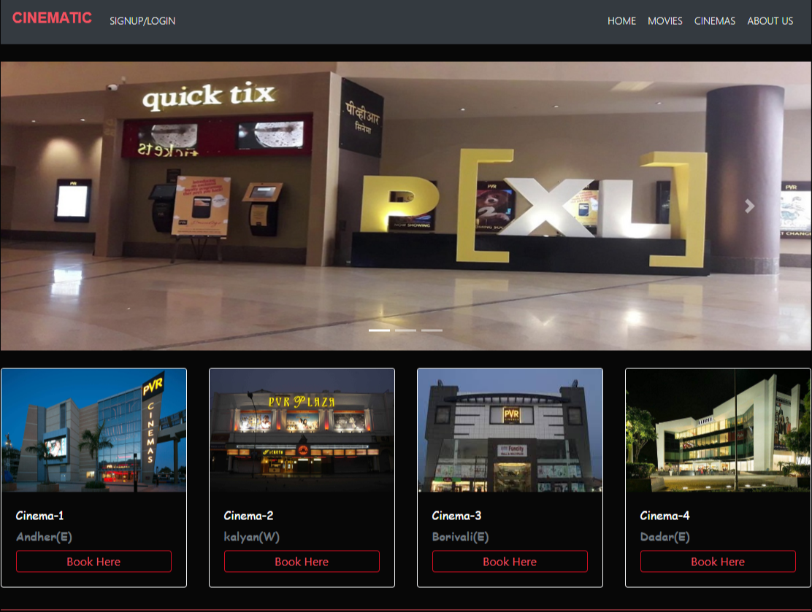
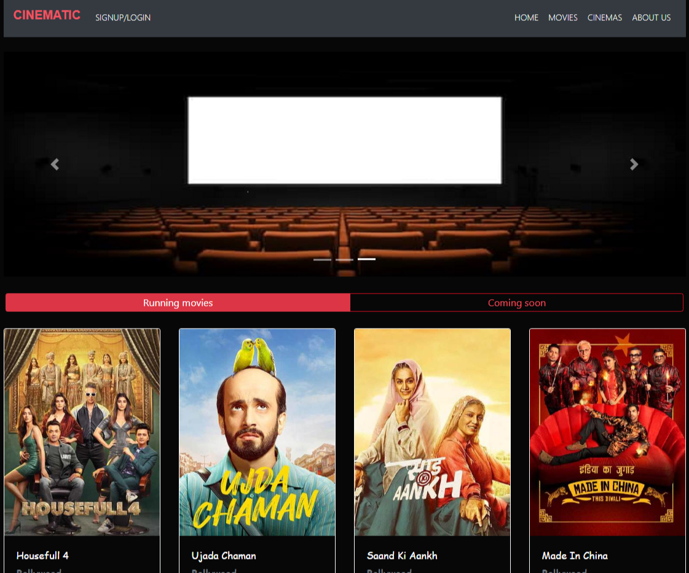
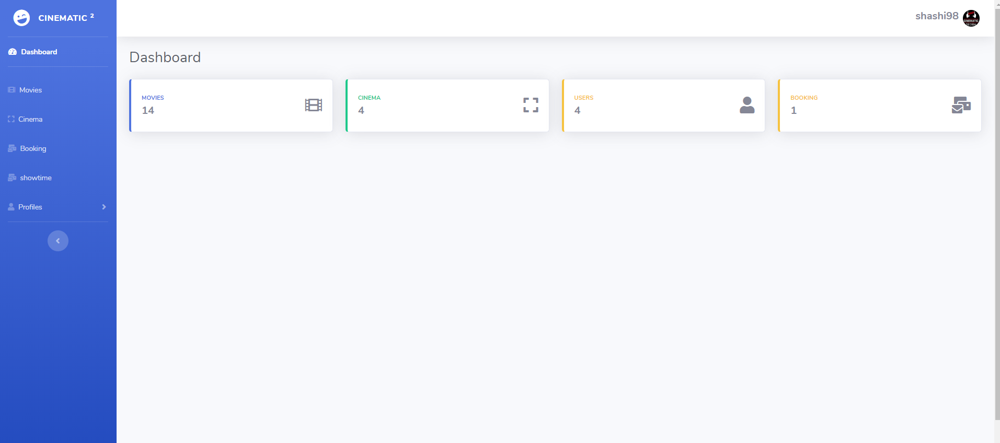
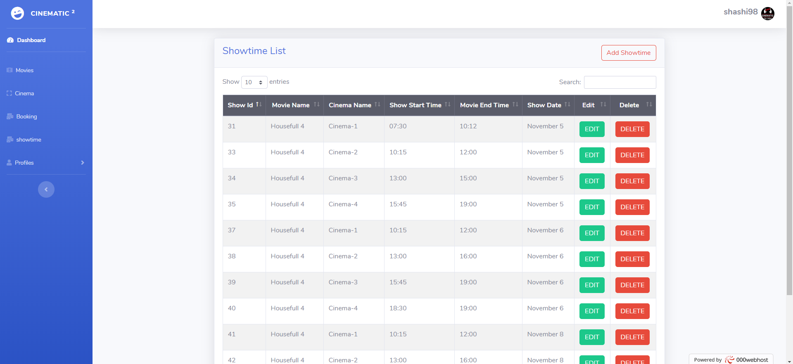
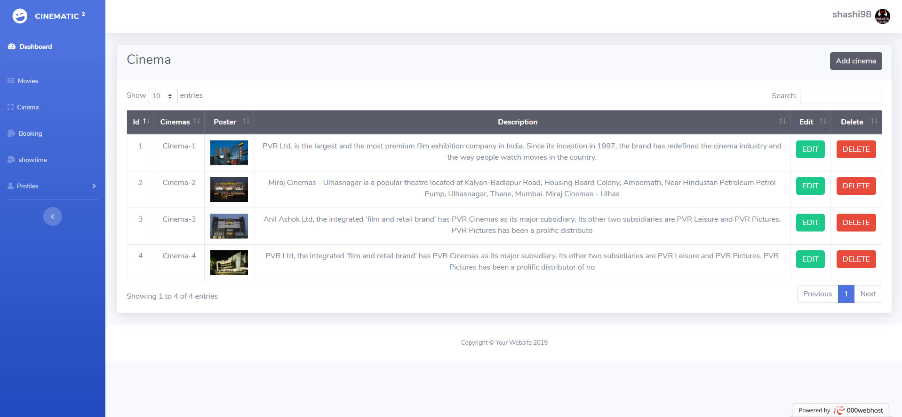

# online-movie-Ticket-booking-using-php
## overview
**Movie Ticket Booking System is a web-based application which is developed using PHP and MySQL. The objective of Download Movie Ticket Booking System is to provide the facility**  **of booking movie tickets online. Customer can view the timing of movie shows and book the show as per the availability. The Whole Project is divided into two parts** 
1. Administrator:- Manage User, Screens Movies, Show Timings, Upcoming Movies
2. Customer:- View Show Timings, currently running movies, Upcoming movies &amp; Book online movie tickets

## Technology(Language) used to develop this Sotware
1. HTML
2. CSS3
3. JAVASCRIPT
4. JQUERY
5. BOOTSTRAP
6. PHP 
7. MYSQLi
## Software Requirements
1. XAMPP
---
**output:-**

>>## Customer

---

___
>>## Administration

---

---
                                                            

### Webiste Link
[visit website](https://cinematicinema.000webhostapp.com "cinematic")

>>>Keep Smiling:smile: and work hard!:computer:
 

